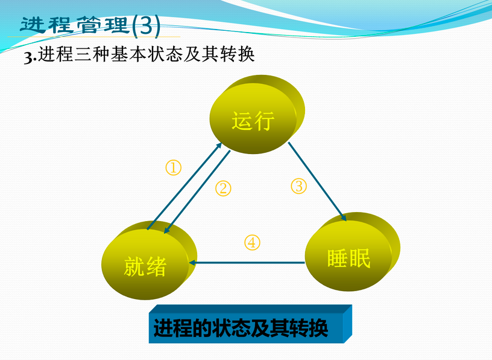
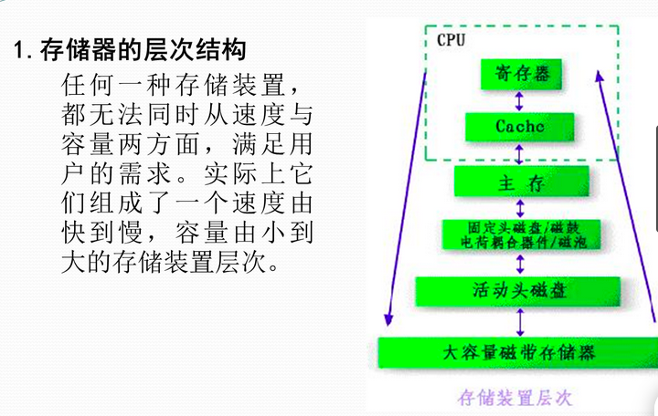

#操作系统与网络 L2

## 1.2 进程管理

### 主要内容

- 进程概念，进程与程序的区别
- 进程三种基本状态（运行态、等待态、就绪态）及其转换
- 进程存在的唯一标志PCB
- 进程调度方法
- 进程的互斥和同步
- 进程与线程的关系

视频？

###概念

进程概念：具有独立功能的、可与其他程序并发执行的程序关于某个数据集合上的一次运行活动。是系统进行资源分配和调度的独立单位。

线程是调度的最小单位，不是资源分配的最小单位。进程是资源分配的最小单位。

进程三种基本状态及其转换：

就绪态：已经分配到除CPU意外的所有必要资源，只等待使用CPU，一旦获得CPU便立即执行

### 进程控制块PCB：描述进程

是进程存在的唯一标志。

### 进程控制：原语操作

### 线程

 - 独立调度的基本单位。
 - 线程也有三态。
 - 线程可并发执行。
 - 多线程共享进程资源和空间。

### 进程调度

按照一定的算法把CPU分配给某一就绪进程，使其由就绪态转为运行态。

#### 进程调度算法：

- 非剥夺式优先算法
- 剥夺式优先算法（适用于实时系统）
- 剥夺与非剥夺式结合优先算法
- 时间片轮转法

**临界资源**：一次仅允许一个进程使用的资源，如打印机、磁带机、共享数据等

**临界区**：每个进程中访问临界资源等那段程序

多个并发进程访问临界资源时，存在竞争制约关系：
- 互斥：多个进程互相排斥地使用临界资源。如磁带机使用、机票订购等问题。
- 同步：指对多个进程在执行次序上的协调，这些进程相互合作，有事需要互相等待或互通消息（相互制约），如生产者-消费者问题。

## 1.3 作业管理

### 作业、作业步

- 作业：用户在外城一次算题过程或一次事物处理过程中，要求计算机系统所做工作的集合。作业包括用户程序、数据和控制作业的命令。
- 作业步：完成作业过程中所经历的各个阶段。作业步相互独立，又相互联系，且有顺序。
- 进程和作业：进程是一个程序在一个数据集上的一次执行，而作业是用户提交给系统的一个任务。用户提交作业后，当作业被调度，系统会为作业创建进程。

### 作业调度

按照某种策略从后备作业队列中选取一个或几个作业，为它们分配必要的资源，建立若干进程，然后由进程调度程序处理。每个作业有唯一作业控制块JCB。

### 常用作业调度算法

- 先来先服务调度算法FCFS
- 短作业优先调度算法SJF
- 响应比高者优先调度算法（$响应比=1+\frac{等待时间}{估计运行时间}=\frac{响应时间}{估计运行时间}$，对于长作业，随着等待时间加长，可以提高优先权。
- 优先数调度算法

### 作业调度算法的目标

- 单位时间内尽可能多的作业
- 使处理机尽可能保持忙碌
- 使各种I/O设备得以充分利用
- 对所有作业都是公平合理的

### 作业调度算法性能的衡量

- 平均周转时间（周转时间=完成时间-提交时间）
- 平均带权周转时间（带权周转时间=周转时间/运行时间，总是大于一）

作业调度不需要分配CPU，进程调度需要分配CPU

## 1.4 内存管理Part1

###存储器的层次结构

### 存储管理的目的

1. 主存的分配和管理：分配&释放
2. 提高主存的利用率：共享主存
3. “扩充”主存容量：为用户提供比主存物理空间大的多的地址空间；调入调出。
4. 存储保护：确保互不干扰，不破坏其他作业或系统文件的信息。

### 基本概念

1. 存储分配：为具体的程序和数据等分配存储单元或存储区工作。
2. 映射：把逻辑地址转换为相应的物理地址的过程。
3. 地址空间：程序用来访问信息所用地址单元的集合
4. 存储空间：主存中物理单元的集合
	- 逻辑地址与地址空间（逻辑空间）
	- 物理地址与存储空间（内存空间
5. 内存扩充：虚拟存储技术
6. 重定位：逻辑地址到物理地址到映射
	- 静态重定位：当用户程序被装入内存时，一次性实现逻辑地址到物理地址到转换，以后不再转换
动态重定位：在程序运行过程中要访问数据时再进行地址变换

### 存储管理方案
1. 实存储管理方案
	- 分区管理（固定分区分配和可变分区分配）
	- **分页管理**
	- 分段管理
2. 虚拟存储管理方案：作业程序空间大雨内存可用空间时
	- **动态分页管理**
	- 段页式管理

#### 分页管理

- 分页：系统把用户程序按逻辑页划分为大小相等的部分，称为页或虚页。
- 块：内存按页的大小划分为大小相等的区域，称为内存块
- 内存分配：以页为单位进行分配，并按作业的页数多少来分配。逻辑上相邻的页，物理上不一定相邻。
- 页表：列出作业的逻辑地址与其在主存中的物理地址之间的对应关系
- 页面大小：大小适中，2的幂，通常为512B ~8KB 

- 地址结构：页号+页内位移量

